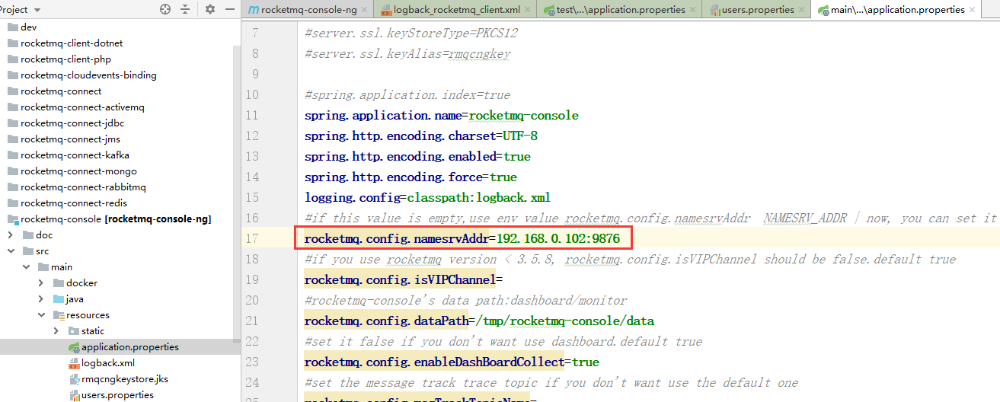
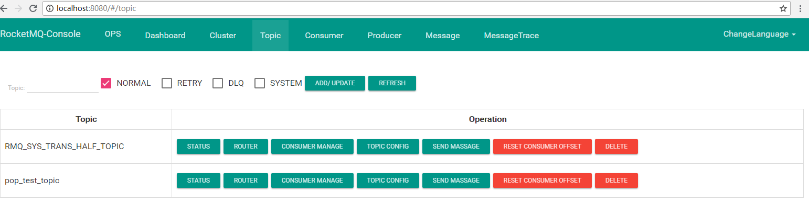
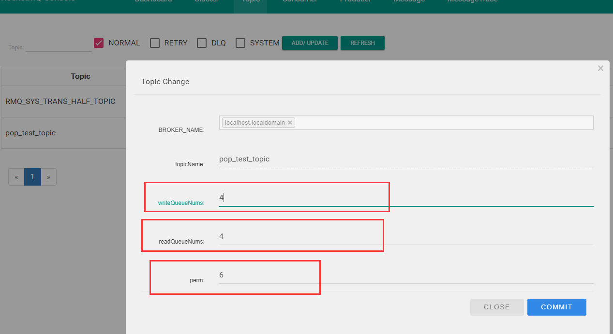
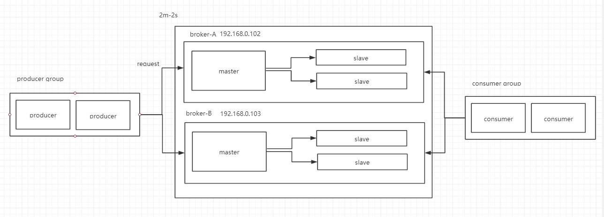
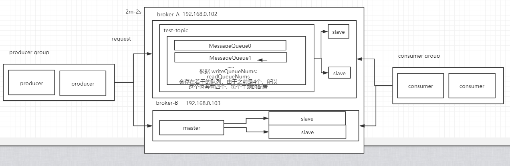
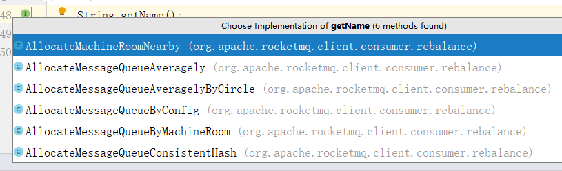
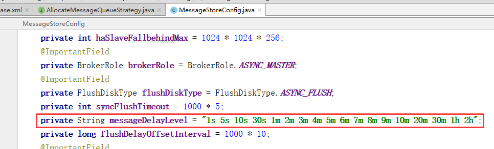

### 实现一个消息中间件的需求

* 消息的发送和接受
* 通信支持->NIO
* 消息的序列化和反序列化
* 是否跨语言
* 消息的确定
* 消息的持久化（内存，磁盘，mysql）
* 高可用（集群）主从
* 是否支持多协议

### RockMQ 解释

下载源码包。

```
https://www.apache.org/dyn/closer.cgi?path=rocketmq/4.5.2/rocketmq-all-4.5.2-source-release.zip
```

cd到distribution下，使用命令编译项目。

```
  > unzip rocketmq-all-4.4.0-source-release.zip
  > cd rocketmq-all-4.4.0/
  > mvn -Prelease-all -DskipTests clean install -U
  > cd distribution/target/apache-rocketmq
```

获得包


然后拷贝到linux下，unzip解压后得到


由于RockMQ自己实现类似zk的注册中心，也就是nameserver，所以，我们需要优先启动nameserver


看到 “ The Name Server boot success. serializeType=JSON  ” 表示启动成功

当然你也可以选择后端启动

```
nohup sh mqnamesrv & 
```

不过，这里可能会启动不了，因为默认配置的内存可用空间设置很大，所以我们需要改两个文件的启动参数。

我们可以用这个命令查看日志。

```
 tail -f ~/logs/rocketmqlogs/broker.log
```

分别是，runbroker.sh 和 runserver.sh

runbroker.sh的内容

```bash
choose_gc_log_directory

JAVA_OPT="${JAVA_OPT} -server -Xms8g -Xmx8g -Xmn4g"
JAVA_OPT="${JAVA_OPT} -XX:+UseG1GC -XX:G1HeapRegionSize=16m -XX:G1ReservePercent=25 -XX:InitiatingHeapOccupancyPercent=30 -XX:SoftRefLRUPolicyMSPerMB=0"
/*原本的值*/
/*修改后*/
choose_gc_log_directory

JAVA_OPT="${JAVA_OPT} -server -Xms256m -Xmx256m -Xmn125m"
JAVA_OPT="${JAVA_OPT} -XX:+UseG1GC -XX:G1HeapRegionSize=16m -XX:G1ReservePercent=25 -XX:InitiatingHeapOccupancyPercent=30 -XX:SoftRefLRUPolicyMSPerMB=0"
```

runserver.sh的内容

```bash
choose_gc_log_directory

JAVA_OPT="${JAVA_OPT} -server -Xms4g -Xmx4g -Xmn2g -XX:MetaspaceSize=128m -XX:MaxMetaspaceSize=320m"
JAVA_OPT="${JAVA_OPT} -XX:+UseConcMarkSweepGC -XX:+UseCMSCompactAtFullCollection -
/*原本的值*/
/*修改后*/
choose_gc_log_directory

JAVA_OPT="${JAVA_OPT} -server -Xms256m -Xmx256m -Xmn125m -XX:MetaspaceSize=128m -XX:MaxMetaspaceSize=320m"
JAVA_OPT="${JAVA_OPT} -XX:+UseConcMarkSweepGC -XX:+UseCMSCompactAtFullCollection -
```

最后启动rockmq

```
nohup sh bin/mqbroker -n localhost:9876 & ：属于后台启动

sh bin/mqbroker -n localhost:9876 ：属于终端启动，直接输出日志信息，按 ctrl+c 可直接关闭退出
```


```
ps -ef|grep nameser
```

### 整合使用

```xml
<dependency>
    <groupId>org.apache.rocketmq</groupId>
    <artifactId>rocketmq-client</artifactId>
    <version>4.5.2</version>
</dependency>
```

生产者代码

```java
public class RocketMqProducer {


    public static void main(String[] args) throws MQClientException, RemotingException, InterruptedException, MQBrokerException {

        /**
         * 生产组，因为rocket中，生产者和消费者都可以进行集群
         */
        DefaultMQProducer producer = new DefaultMQProducer("pop_producer");
        //设置 nameserver 的地址
        producer.setNamesrvAddr("192.168.0.102:9876");//会从命名服务器上拿到broker的地址
        producer.start();//启动

        int num = 0;
        while(num<20){
            num++;
            //Topic                                         tag 算是一种路由，筛选
            Message message = new Message("pop_test_topic","TagA",("hello,rockmq"+num).getBytes());
            SendResult result=producer.send(message);
            System.out.println(result);
        }
    }
}
```

输出结果

```
SendResult [sendStatus=SEND_OK, msgId=A9FE451423CC18B4AAC29514F9DE0000, offsetMsgId=C0A8006600002A9F0000000000000000, messageQueue=MessageQueue [topic=pop_test_topic, brokerName=localhost.localdomain, queueId=3], queueOffset=0]
SendResult [sendStatus=SEND_OK, msgId=A9FE451423CC18B4AAC29514FA0D0001, offsetMsgId=C0A8006600002A9F00000000000000B4, messageQueue=MessageQueue [topic=pop_test_topic, brokerName=localhost.localdomain, queueId=0], queueOffset=0]
SendResult [sendStatus=SEND_OK, msgId=A9FE451423CC18B4AAC29514FA1C0002, offsetMsgId=C0A8006600002A9F0000000000000168, messageQueue=MessageQueue [topic=pop_test_topic, brokerName=localhost.localdomain, queueId=1], queueOffset=0]
SendResult [sendStatus=SEND_OK, msgId=A9FE451423CC18B4AAC29514FA230003, offsetMsgId=C0A8006600002A9F000000000000021C, messageQueue=MessageQueue [topic=pop_test_topic, brokerName=localhost.localdomain, queueId=2], queueOffset=0]
SendResult [sendStatus=SEND_OK, msgId=A9FE451423CC18B4AAC29514FA270004, offsetMsgId=C0A8006600002A9F00000000000002D0, messageQueue=MessageQueue [topic=pop_test_topic, brokerName=localhost.localdomain, queueId=3], queueOffset=1]
/...
```

消费者代码

```java
public class RocketMqConsumer {

    public static void main(String[] args) throws MQClientException {

        DefaultMQPushConsumer consumer =
                new DefaultMQPushConsumer("pop_consumer_group");
        consumer.setNamesrvAddr("192.168.0.102:9876");
        //从哪里开始消费 表示如果这个消费组是第一次启动，那么从第一个开始消费
        consumer.setConsumeFromWhere(ConsumeFromWhere.CONSUME_FROM_FIRST_OFFSET);
        //     后面可以是一个表达式，订阅，这下面的主题下面的具体tag，大概是
        consumer.subscribe("pop_test_topic","*");

        //注册监听
        consumer.registerMessageListener(new MessageListenerConcurrently() {
            @Override
            public ConsumeConcurrentlyStatus consumeMessage(List<MessageExt> msgs, ConsumeConcurrentlyContext context) {

                System.out.println("Recevice Message: "+msgs);

                return ConsumeConcurrentlyStatus.CONSUME_SUCCESS;//签收
            }
        });

        consumer.start();
    }

}
```

输出信息

```
Recevice Message: [MessageExt [queueId=2, storeSize=180, queueOffset=1, sysFlag=0, bornTimestamp=1567089979953, bornHost=/192.168.0.1:51824, storeTimestamp=1567089978942, storeHost=/192.168.0.102:10911, msgId=C0A8006600002A9F00000000000004EC, commitLogOffset=1260, bodyCRC=967451788, reconsumeTimes=0, preparedTransactionOffset=0, toString()=Message{topic='pop_test_topic', flag=0, properties={MIN_OFFSET=0, MAX_OFFSET=5, CONSUME_START_TIME=1567090488022, UNIQ_KEY=A9FE451423CC18B4AAC29514FA310007, WAIT=true, TAGS=TagA}, body=[104, 101, 108, 108, 111, 44, 114, 111, 99, 107, 109, 113, 56], transactionId='null'}]]
Recevice Message: [MessageExt [queueId=2, storeSize=181, queueOffset=3, sysFlag=0, bornTimestamp=1567089979985, bornHost=/192.168.0.1:51824, storeTimestamp=1567089978974, storeHost=/192.168.0.102:10911, msgId=C0A8006600002A9F0000000000000A92, commitLogOffset=2706, bodyCRC=684565618, reconsumeTimes=0, preparedTransactionOffset=0, toString()=Message{topic='pop_test_topic', flag=0, properties={MIN_OFFSET=0, MAX_OFFSET=5, CONSUME_START_TIME=1567090488022, UNIQ_KEY=A9FE451423CC18B4AAC29514FA51000F, WAIT=true, TAGS=TagA}, body=[104, 101, 108, 108, 111, 44, 114, 111, 99, 107, 109, 113, 49, 54], transactionId='null'}]]
Recevice Message: [MessageExt [queueId=2, storeSize=181, queueOffset=4, sysFlag=0, bornTimestamp=1567089980005, bornHost=/192.168.0.1:51824, storeTimestamp=1567089978993, storeHost=/192.168.0.102:10911, msgId=C0A8006600002A9F0000000000000D66, commitLogOffset=3430, bodyCRC=1786991236, reconsumeTimes=0, preparedTransactionOffset=0, toString()=Message{topic='pop_test_topic', flag=0, properties={MIN_OFFSET=0, MAX_OFFSET=5, CONSUME_START_TIME=1567090488023, UNIQ_KEY=A9FE451423CC18B4AAC29514FA650013, WAIT=true, TAGS=TagA}, body=[104, 101, 108, 108, 111, 44, 114, 111, 99, 107, 109, 113, 50, 48], transactionId='null'}]]
Recevice Message: [MessageExt [queueId=1, storeSize=180, queueOffset=0, sysFlag=0, bornTimestamp=1567089979932, bornHost=/192.168.0.1:51824, storeTimestamp=1567089978924, storeHost=/192.168.0.102:10911, msgId=C0A8006600002A9F0000000000000168, commitLogOffset=360, bodyCRC=779681028, reconsumeTimes=0, preparedTransactionOffset=0, toString()=Message{topic='pop_test_topic', flag=0, properties={MIN_OFFSET=0, MAX_OFFSET=5, CONSUME_START_TIME=1567090488026, UNIQ_KEY=A9FE451423CC18B4AAC29514FA1C0002, WAIT=true, TAGS=TagA}, body=[104, 101, 108, 108, 111, 44, 114, 111, 99, 107, 109, 113, 51], transactionId='null'}]]

```

### 使用控制台

```
https://github.com/PopCandier/rocketmq-externals
```

完成后，修改配置文件ip地址，然后启动，因为本身就是springboot项目



启动项目





我们之前一开始发现，打印出来的是四个四个一分组的，其实这个设置可以看得很清楚，由于rocketmq多主多从，并且读写分离，所以writeQueueNums是写的队列个数，和读的队列个数，两者保持相等，不相等会有浪费的情况，例如write是5，read是8，那么就会有3个读队列会被浪费。

perm表示权限的意思。

异步发送的情况

```java
//异步发送
            producer.send(message, new SendCallback() {
                @Override
                public void onSuccess(SendResult sendResult) {
                    //执行回调成功
                }

                @Override
                public void onException(Throwable e) {
                    //发生异常
                }
            });
```

OneWay，上面有同步和异步的方式进行发送，还有一种oneway的方法，表示，我只管发送，不管回执，结果。

```java
producer.sendOneway(message);//只负责发送
```

#### Rocket MQ的高可用方案

rocketmq中有一种叫做2m2s，两主两从的方案。



由于RocketMQ是参考kafka的，所以必然会有一些东西与其相似。

* rocketmq并没有实现master选举（通过配置文件去指定主从关系），kafka是有简单的主从选举的。
* rocket 中的mater可以接受事务请求，salve可以接受读请求，所有rocket可以实现读写分离，salve只会和master同步数据，以响应读请求，当master挂掉后，这个broker无法再次接受读请求，但是消费者还是可以消费在master挂掉之前，与master同步后的slave请求。
  * kafka中，面对master的挂掉，他的方案是提供分区（partition），但是分区只会用作backup使用，也就是说，分区存在的意义就是同步master的数据，本身并不能接受请求，master是接受了读请求和写请求的，当master挂掉后，与master保持低延迟的slave将会从维持分区的ISR中被选为master。
* 回到2m2s的问题上，rocketmq面对master挂掉的方案是，尽可能启动多的节点，当你使用2m2s的方案的时候，当broker-A的master挂掉后，生产组（producer group）将会发送写请求到broker-B上，由于broker-A的slave节点并没有挂掉，所以，还是能被消费组（consumer group）消费，他们是可以同时消费broker-A和broker-B的slave队列的。

以上就是RocketMQ的高可用的解决方案。

#### RocketMQ 的分区



所以，本身请求会出现两次分发 request->broker-A/broker-B->MessageQueue0/MessageQueue1

节点，到具体分类，这样的多分区，就可以提高高并发。当然，这里有很多分发的算法实现，除了消费的分发，还有生产者的分发。

```
AllocateMessageQueueStrategy
```



* 就近机房
* 平均
* 环状平均
* 配置
* 机房
* 一致性hash

### RocketMQ 的 rebalance

kafka是在coordinator中完成分配分区消费，当有消费者断开或者连接都会触发重新负载。

在rocketmq中，消费组的人员减少同样会触发重新负载，他会将无法被消费的分区给前面的消费者消费，并且rocketmq会每10s触发一次rebalance

### RocketMQ 的 顺序消费

之前，我们了解到，请求落到具体队列（Queue）可能会经历两次分发，但是如果消费需要完成顺序的消费，就需要保证，要求顺序的消息**必须**落到同一个queue，或者说同一个分区才可以。

这一步需要生产端和消费端共同制定才可以。

首先是生产者

```java
//指定发送策略
            producer.send(message, new MessageQueueSelector() {
                @Override
                public MessageQueue select(List<MessageQueue> mqs, Message msg, Object arg) {
                    System.out.println(mqs.size());//4个，因为之前控制台看到了
                    return mqs.get(0);//我们也可以指定落到具体0号分区,这样所有消息都落到0号分区了。
                }
            },"key-"+num);//这里的key和select 方法中的arg应该一样的，你可以通过指定具体的key，来进行取模之类的，保证落到哪个分区
            //这里可以会想起了kafka的log落到50分区的算法，key的hash和50取模
```

消费者

```java
//顺序消费
        consumer.registerMessageListener(new MessageListenerOrderly() {
            @Override
            public ConsumeOrderlyStatus consumeMessage(List<MessageExt> msgs, ConsumeOrderlyContext context) {
                return null;
            }
        });
```

### 可靠性的消息

消费端的消息签收。表示回执ack

```java
//顺序消费
        consumer.registerMessageListener(new MessageListenerOrderly() {
            @Override
            public ConsumeOrderlyStatus consumeMessage(List<MessageExt> msgs, ConsumeOrderlyContext context) {
                //假如这里抛出了一个异常
                //导致签收有问题，我们希望可以重发，表示手动再发一次
                return ConsumeOrderlyStatus.SUCCESS;//回执 签收
            }
        });
```

衰减重试

```
1s 5s 10s 30s
```

逐渐递增。默认16次重试，全部失败后，进入死信队列DLQ



进入死信队列后，靠一个消费者在考虑后续。

```java
//顺序消费
        consumer.registerMessageListener(new MessageListenerOrderly() {
            @Override
            public ConsumeOrderlyStatus consumeMessage(List<MessageExt> msgs, ConsumeOrderlyContext context) {

                MessageExt ext = msgs.get(0);

                if(ext.getReconsumeTimes()==3){//超过了三次
                    //持久化处理
                    return ConsumeOrderlyStatus.SUCCESS;
                }

                return ConsumeOrderlyStatus.SUCCESS;
            }
        });
```

建立一个这个的消息记录表，然后用定时任务去扫描，做后续的重发，或者其他什么操作。