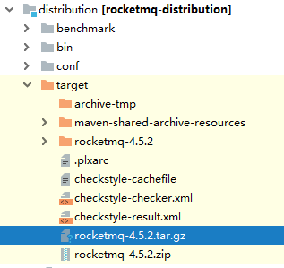
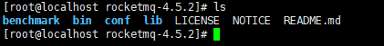
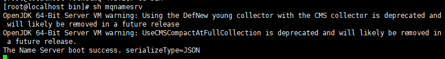
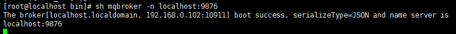

### RockMQ 解释

下载源码包。

```
https://www.apache.org/dyn/closer.cgi?path=rocketmq/4.5.2/rocketmq-all-4.5.2-source-release.zip
```

cd到distribution下，使用命令编译项目。

```
  > unzip rocketmq-all-4.4.0-source-release.zip
  > cd rocketmq-all-4.4.0/
  > mvn -Prelease-all -DskipTests clean install -U
  > cd distribution/target/apache-rocketmq
```

获得包



然后拷贝到linux下，unzip解压后得到



由于RockMQ自己实现类似zk的注册中心，也就是nameserver，所以，我们需要优先启动nameserver



看到 “ The Name Server boot success. serializeType=JSON  ” 表示启动成功

当然你也可以选择后端启动

```
nohup sh mqnamesrv & 
```

不过，这里可能会启动不了，因为默认配置的内存可用空间设置很大，所以我们需要改两个文件的启动参数。

我们可以用这个命令查看日志。

```
 tail -f ~/logs/rocketmqlogs/broker.log
```

分别是，runbroker.sh 和 runserver.sh

runbroker.sh的内容

```bash
choose_gc_log_directory

JAVA_OPT="${JAVA_OPT} -server -Xms8g -Xmx8g -Xmn4g"
JAVA_OPT="${JAVA_OPT} -XX:+UseG1GC -XX:G1HeapRegionSize=16m -XX:G1ReservePercent=25 -XX:InitiatingHeapOccupancyPercent=30 -XX:SoftRefLRUPolicyMSPerMB=0"
/*原本的值*/
/*修改后*/
choose_gc_log_directory

JAVA_OPT="${JAVA_OPT} -server -Xms256m -Xmx256m -Xmn125m"
JAVA_OPT="${JAVA_OPT} -XX:+UseG1GC -XX:G1HeapRegionSize=16m -XX:G1ReservePercent=25 -XX:InitiatingHeapOccupancyPercent=30 -XX:SoftRefLRUPolicyMSPerMB=0"
```

runserver.sh的内容

```bash
choose_gc_log_directory

JAVA_OPT="${JAVA_OPT} -server -Xms4g -Xmx4g -Xmn2g -XX:MetaspaceSize=128m -XX:MaxMetaspaceSize=320m"
JAVA_OPT="${JAVA_OPT} -XX:+UseConcMarkSweepGC -XX:+UseCMSCompactAtFullCollection -
/*原本的值*/
/*修改后*/
choose_gc_log_directory

JAVA_OPT="${JAVA_OPT} -server -Xms256m -Xmx256m -Xmn125m -XX:MetaspaceSize=128m -XX:MaxMetaspaceSize=320m"
JAVA_OPT="${JAVA_OPT} -XX:+UseConcMarkSweepGC -XX:+UseCMSCompactAtFullCollection -
```

最后启动rockmq

```
nohup sh bin/mqbroker -n localhost:9876 & ：属于后台启动

sh bin/mqbroker -n localhost:9876 ：属于终端启动，直接输出日志信息，按 ctrl+c 可直接关闭退出
```

